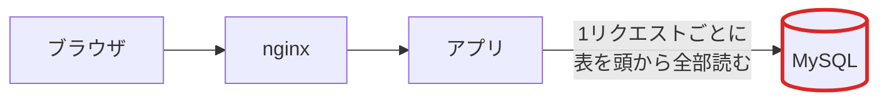
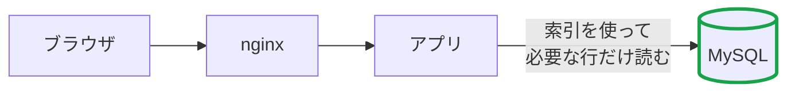

<!--
このPRを書くときのルール

1. 概要では「前はどうなっていて失敗（または遅く）なっていたのか」と
   「今回どの設定・変更を入れてどう直ったのか」を、図で見て分かるようにする。
2. IT用語を使うときは、その語が何を指すのかを一言そえる。
   例: 「インデックス（MySQL が目的の行を探すための索引。無いと表を頭から全部読む）」
3. 気取った言い回しや、かっこいいだけの言葉は使わない。読んで分かる普通の日本語で書く。
-->

## 概要

<!-- 何を変えたPRなのか1〜2行で。例: comments テーブルの post_id に索引を足して、コメント取得で表を全部読まないようにした -->

### 前の状態（なぜ失敗・遅くなっていたか）

<!--
図で説明する。矢印のラベルに「何が起きていたか」を書くと伝わりやすい。
下は雛形なので、実際の内容に書き換える。

GitHub は PR 本文に直接書いた <svg> タグを消してしまうので、SVG を貼り付けても表示されない。
代わりに Mermaid（テキストで書いた図を GitHub が絵にしてくれる仕組み）で書く。
手描きの図や計測のグラフを見せたいときは、画像ファイルをこの欄にドラッグ&ドロップして添付する。
-->



### 今回の変更で直った状態



## 課題 / ボトルネック

<!--
「なんとなく遅そうだから」ではなく、計測して見つけた根拠を書く。
- どのURL / どのクエリが、どれくらい時間を食っていたか
- alp（nginx のアクセスログを URL ごとに集計するツール）や
  pt-query-digest（MySQL のスロークエリログを集計するツール）の該当行を貼る
-->

## 改修内容

<!-- やったことを箇条書きで。設定ファイル / テーブル定義 / アプリのどこを触ったか分かるように -->

-

### 変更していないこと / スコープ外

<!-- 「ついでに直したくなったが今回はやらなかった」ものがあれば。次のPRの種になる -->

## 計測結果

計測手順: `make bench`（`make log-clean` でログを空にしてから、前回と同じ条件で実行）

| | before | after |
| --- | --- | --- |
| score | | |
| success | | |
| fail | | |

<details>
<summary>alp (before / after)</summary>

```
before

```

```
after

```

</details>

<details>
<summary>pt-query-digest (before / after)</summary>

```
before

```

```
after

```

</details>

<!--
計測時の注意:
- before / after は必ず同じ条件（同じマシン・同じ初期データ・ログを消した直後）で取る
- 数字のブレが大きいときは何回かまわして、最小〜最大も書く
-->

## なぜ直ったのか

<!--
数字が良くなった理由を、計測結果と結びつけて書く。上の図とも話がつながるようにする。
例: 読む行数が数万行から数十行になり、コメント取得のクエリの合計時間が X 秒から Y 秒に減った。
    その結果、次に重いのは Z になった。
思っていた理由と違った場合（別の要因で上がった / 下がった）も、そのまま書く。
-->

## 影響範囲・リスク

<!--
- 他のURLやクエリへの影響（索引を足すと書き込みが少し遅くなる、メモリを食う、キャッシュと DB の中身がずれる など）
- 5言語の実装（Ruby / Go / PHP / Python / Node.js）のうちどれを触ったか。
  URL・テーブル定義・セッション・テンプレートに触った場合は、他の実装への影響も見る
- 壊れたときの戻し方（revert だけで戻るか、DB や設定も戻す必要があるか）
-->

## 反映に必要な作業

<!-- マージしただけでは効かないもの。例: テーブル定義の変更を DB に適用、nginx / MySQL の再起動、アプリの再ビルド。なければ「なし」 -->

- [ ] なし

## 確認したこと

- [ ] `make bench` が `pass: true` / `fail: 0`
- [ ] 画面表示が崩れていない（トップ / 投稿詳細 / ユーザーページ / 画像表示）
- [ ] エラーログ（nginx の error.log とアプリのログ）に新しいエラーが出ていない
- [ ] 本文で使ったIT用語に、意味の説明を一言そえた

## 用語メモ

<!--
このPRで出てくる用語のうち、チームで意味がそろっていなさそうなものを一言で書く。なければ消してよい。
例:
- keepalive: 一度つないだ通信路を切らずに使い回す設定。毎回つなぎ直す手間が減る。
-->

## 次にやること

<!-- このPRのあと、次に重くなっている場所や、残したTODO -->
